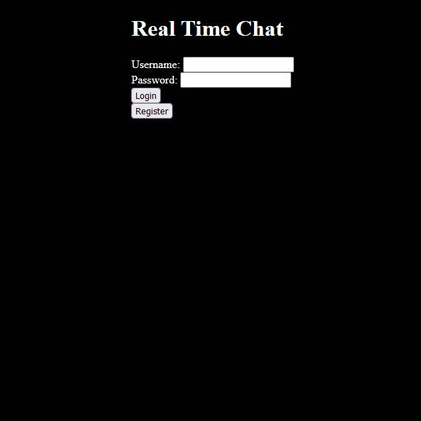
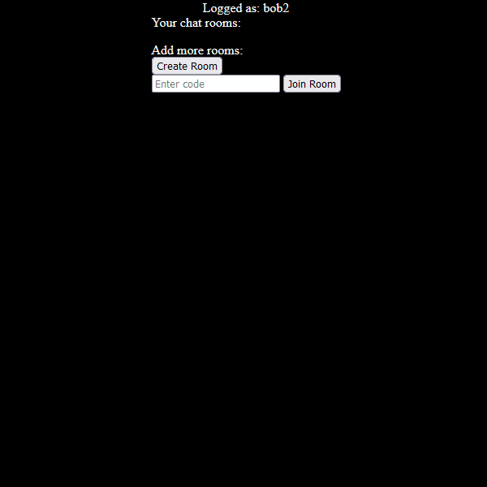
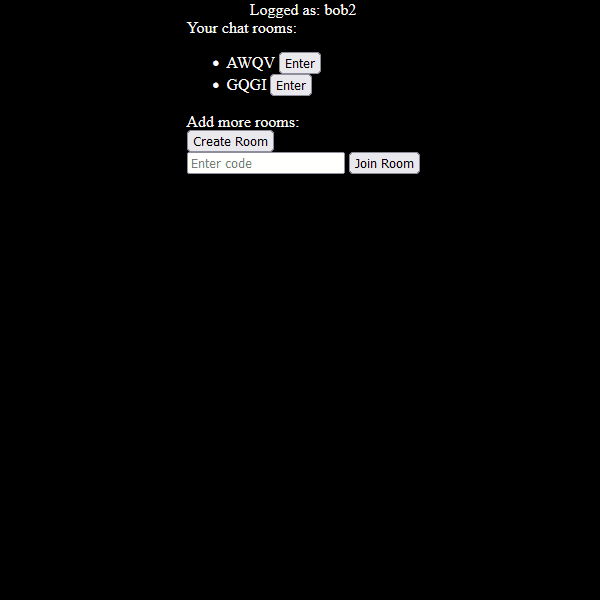

# Real Time Chat 
Objective:
Create a web application made in Flask that allows users to chat in real time, messages are stored in PostreSQL database.  

### Register and login users
  
### Create and join rooms
  
### Chat in real time
  

Thoughts:  
.ini files are for changing parameters (e.g params for connection to sql database) without need to change code of the app  

Steps:  
Connect to PostgreSQL DONE  
Make accounts, and store their info in database DONE    
Use account to create rooms and chat in there, store messages in database (user,message,date) DONE   
Load stored messages from a chat room  DONE  
Live loading messages  DONE
Admin Panel?
Switch to light/darkmode?
Build more web app features?  
Add NLP to generate text messages (Optional)  